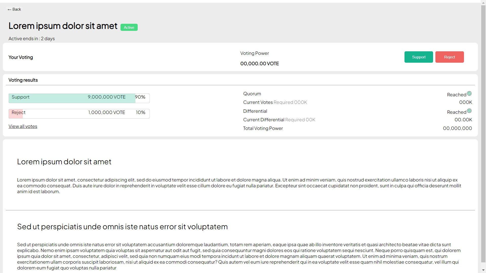

## BETA Finance Fullstack Engineer Assignment


## Part 1: System Design

1. Monitor every exchange current price
2. If the price gap larger than the threshold and the arbitrage program will be trigger
3. There will have two exhange been find out have a gap, and check if there has sufficient asset to be buy or sell
4. If anything correct, and it will execute normally
5. Finally check if the profit over 0, it will be fine.

## Part 2: Simple Frontend Implementation

#### Env Rebuild
- Change the directory to the wroking place
```agsl
cd simple_application/app
```
- Install the require package
```agsl
npm install
```
- Run the server and wait for the web response
```agsl
npm start
```

##### Page Looks


##### TODO
1. Make the words and sentence as variable for data eazy change
2. Make it shows normally on phone page
